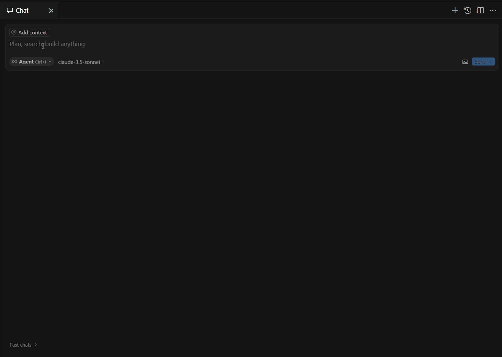

# NetContextServer

<div align="center">

🔍 **Supercharge Your AI Coding Assistant with Deep .NET Codebase Understanding**

[](https://opensource.org/licenses/MIT)
[](https://dotnet.microsoft.com/)
[](https://modelcontextprotocol.io/)
[](https://github.com/willibrandon/NetContextServer/actions/workflows/ci.yaml)

</div>

NetContextServer empowers AI coding assistants like Cursor AI to deeply understand your .NET codebase through the [Model Context Protocol (MCP)](https://modelcontextprotocol.io/introduction). This means more accurate code suggestions, better answers to your questions, and a more productive coding experience.



## ✨ Key Features

- 🧠 **Semantic Code Search**: Find code by describing what you're looking for in natural language
- 🔍 **Intelligent Navigation**: Help AI tools understand your project structure and dependencies
- 🛡️ **Built-in Security**: Safe file access with automatic protection of sensitive data
- 🚀 **Cursor AI Integration**: Seamless setup with Cursor AI for enhanced coding assistance
- 📦 **Package Analysis**: Understand your dependencies and get update recommendations
  - 🔍 **Deep Dependency Visualization**: See transitive dependencies with interactive, color-coded graphs
  - 🧩 **Smart Grouping**: Visually group related packages for easier navigation
  - 📊 **Update Recommendations**: Identify outdated packages and security issues
- ⚡ **Fast & Efficient**: Quick indexing and response times for large codebases

## 🚀 Quick Start

1. **Clone & Build**:
```bash
git clone https://github.com/willibrandon/NetContextServer.git
cd NetContextServer
dotnet build
```

2. **Set Up** (optional, for semantic search):
```bash
# Set Azure OpenAI credentials in environment:
AZURE_OPENAI_ENDPOINT=your_endpoint
AZURE_OPENAI_API_KEY=your_key
```

3. **Start Using**:
```bash
# Point to your project
dotnet run --project src/NetContextClient/NetContextClient.csproj -- set-base-dir --directory "path/to/your/project"

# Try semantic search
dotnet run --project src/NetContextClient/NetContextClient.csproj -- semantic-search --query "find authentication logic"
```

👉 **[Read our Getting Started Guide](docs/getting-started.md)** for detailed setup instructions and best practices.

## 🔌 Integration with Cursor AI

1. Open Cursor AI
2. Press `Cmd/Ctrl + Shift + P`
3. Type "Configure MCP Server"
4. Enter:
```json
{
  "command": "dotnet",
  "args": ["run", "--project", "path/to/NetContextServer/src/NetContextServer/NetContextServer.csproj"]
}
```

Now Cursor AI can understand your codebase! Try asking it questions like:
- "List all .NET source files in this project directory"
- "Search for exact text matches in the code files"
- "Analyze NuGet packages in all projects"
- "Get the current list of ignore patterns"
- "Add these ignore patterns: *.generated.cs, bin/*"
- "List all .csproj files in this directory"
- "Show me the contents of this file"
- "What's the current base directory for file operations?"

## 📚 Documentation

- [Getting Started Guide](docs/getting-started.md) - Quick setup and first steps
- [Tool Reference](docs/tool-reference.md) - Detailed tool documentation
- [Configuration Guide](docs/configuration.md) - Advanced configuration options
- [Integration Examples](docs/integrations.md) - Using with different AI tools
- [Contributing Guide](CONTRIBUTING.md) - How to help improve NetContextServer

## Features

- 📁 **Project & File Listing**: List all projects and source files in your solution
- 🔍 **Code Search**: Search through your codebase for specific patterns or text
- 🧠 **Semantic Search**: Find code based on meaning, not just exact text matches
- 📖 **File Content Access**: Read source files with safety checks and size limits
- 🛡️ **Security**: Built-in safeguards for sensitive files and directory access
- 🎯 **Pattern Management**: Flexible ignore patterns for controlling file access

## Building from Source

1. Clone the repository:
```bash
git clone https://github.com/willibrandon/NetContextServer.git
cd NetContextServer
```

2. Build the solution:
```bash
dotnet build
```

3. Run the tests (optional):
```bash
dotnet test
```

## Running Commands

Use the client to interact with your codebase:
```bash
dotnet run --project src/NetContextClient/NetContextClient.csproj -- <command> [options]
```

### Environment Setup

For semantic search functionality, you need to set up the following environment variables:
- `AZURE_OPENAI_ENDPOINT`: Your Azure OpenAI endpoint URL
- `AZURE_OPENAI_API_KEY`: Your Azure OpenAI API key

## Usage

### Basic Commands

1. **Set Base Directory**:
```bash
dotnet run --project src/NetContextClient/NetContextClient.csproj -- set-base-dir --directory "D:\YourProject"
```

2. **Get Base Directory**:
```bash
dotnet run --project src/NetContextClient/NetContextClient.csproj -- get-base-dir
```

3. **List Projects**:
```bash
dotnet run --project src/NetContextClient/NetContextClient.csproj -- list-projects-in-dir --directory "D:\YourProject\src"
```

4. **List Source Files**:
```bash
dotnet run --project src/NetContextClient/NetContextClient.csproj -- list-source-files --project-dir "D:\YourProject\src\YourProject"
```

5. **Analyze Packages**:
```bash
# Set your base directory first
dotnet run --project src/NetContextClient/NetContextClient.csproj -- set-base-dir --directory "path/to/your/project"

# Run the package analysis
dotnet run --project src/NetContextClient/NetContextClient.csproj -- analyze-packages
```

Example output:
```
Project: MyProject.csproj
  Found 2 package(s):
  - ✅ Newtonsoft.Json (13.0.1)
    Used in 5 location(s)

    Dependencies:
    └─ Newtonsoft.Json
       └─ System.*
          └─ System.ComponentModel

  - 🔄 Microsoft.Extensions.DependencyInjection (5.0.2 → 6.0.1)
    Update available: 6.0.1

    Dependencies:
    └─ Microsoft.Extensions.DependencyInjection
       └─ Microsoft.*
          └─ Microsoft.Extensions.DependencyInjection.Abstractions
```

### Search Commands

1. **Text Search**:
```bash
dotnet run --project src/NetContextClient/NetContextClient.csproj -- search-code --text "authentication"
```

2. **Semantic Search**:
```bash
# Search with default number of results (5)
dotnet run --project src/NetContextClient/NetContextClient.csproj -- semantic-search --query "handle user authentication"

# Search with custom number of results
dotnet run --project src/NetContextClient/NetContextClient.csproj -- semantic-search --query "database connection string" --top 10
```

The semantic search feature:
- Uses embeddings to find code based on meaning
- Returns code snippets ranked by relevance
- Shows line numbers and similarity scores
- Automatically indexes your code on first search

### Pattern Management

1. **Add Ignore Patterns**:
```bash
dotnet run --project src/NetContextClient/NetContextClient.csproj -- add-ignore-patterns --patterns "*.txt" "*.log"
```

2. **View Current Patterns**:
```bash
dotnet run --project src/NetContextClient/NetContextClient.csproj -- get-ignore-patterns
```

3. **Remove Specific Patterns**:
```bash
dotnet run --project src/NetContextClient/NetContextClient.csproj -- remove-ignore-patterns --patterns "*.txt"
```

4. **Clear User Patterns**:
```bash
dotnet run --project src/NetContextClient/NetContextClient.csproj -- clear-ignore-patterns
```

5. **View State File Location**:
```bash
dotnet run --project src/NetContextClient/NetContextClient.csproj -- get-state-file-location
```

### Default Ignore Patterns

The following patterns are ignored by default to protect sensitive information:
- `*.env` - Environment files
- `appsettings.*.json` - Application settings
- `*.pfx` - Certificate files
- `*.key` - Key files
- `*.pem` - PEM files
- `*password*` - Files containing "password" in the name
- `*secret*` - Files containing "secret" in the name

## Security Features

1. **Path Safety**: Files can only be accessed within the specified base directory
2. **Pattern Validation**: Ignore patterns are validated for proper syntax
3. **Size Limits**: Large file contents are truncated to prevent memory issues
4. **Sensitive File Protection**: Built-in patterns protect common sensitive files

## Example Workflow

1. Set the base directory for your project:
```bash
dotnet run --project src/NetContextClient/NetContextClient.csproj -- set-base-dir --directory "D:\Projects\MyApp"
```

2. Set up custom ignore patterns:
```bash
dotnet run --project src/NetContextClient/NetContextClient.csproj -- add-ignore-patterns --patterns "*.generated.cs" "*.designer.cs"
```

3. List all projects:
```bash
dotnet run --project src/NetContextClient/NetContextClient.csproj -- list-projects-in-dir --directory "D:\Projects\MyApp\src"
```

4. Analyze your project's package dependencies:
```bash
dotnet run --project src/NetContextClient/NetContextClient.csproj -- analyze-packages
```

5. Search for authentication-related code:
```bash
dotnet run --project src/NetContextClient/NetContextClient.csproj -- semantic-search --query "user authentication and authorization logic"
```

## Integration with AI Coding Tools

NetContextServer implements the [Model Context Protocol (MCP)](https://modelcontextprotocol.io/introduction), allowing seamless integration with AI coding assistants that support this protocol, such as:

- **Cursor AI**: Provides your AI assistant with full context of your codebase for more accurate code generation and assistance
- **Other MCP-compatible tools**: Any tool that implements the Model Context Protocol can connect to NetContextServer

To use with Cursor AI:
1. Configure Cursor AI to use the NetContextServer as its MCP provider
2. Enjoy enhanced code assistance with full codebase context

For testing and debugging MCP interactions, you can use [CursorMCPMonitor](https://github.com/willibrandon/CursorMCPMonitor), a real-time monitoring tool that helps track and analyze communications between MCP clients and servers.

The Model Context Protocol enables AI tools to request specific information about your codebase, making the AI's suggestions more relevant and accurate to your specific project structure and coding patterns.

## Error Handling

The server provides clear error messages for common scenarios:
- Directory not found
- Access denied (outside base directory)
- Invalid patterns
- File size limits exceeded
- Restricted file types
- Missing environment variables for semantic search

## Contributing

1. Fork the repository
2. Create a feature branch
3. Commit your changes
4. Push to the branch
5. Create a Pull Request

## License

This project is licensed under the MIT License - see the [LICENSE](./LICENSE) file for details.
